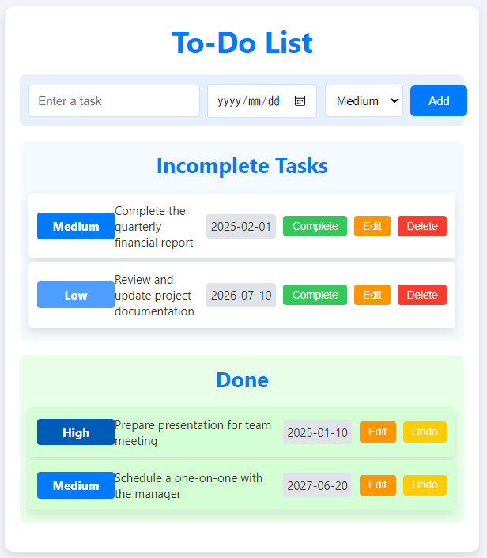

# React TODO Application with JSON Server

This is a simple TODO application built with React and JSON Server for managing TODO items with CRUD operations.

## Table of Contents

- [Features](#features)
- [Installation](#installation)
- [Usage](#usage)
- [Project Structure](#project-structure)
- [Dependencies](#dependencies)
- [Contributing](#contributing)
- [License](#license)

## Features



- Add Tasks: You can add new tasks.
- Edit Tasks: You can edit existing tasks.
- Delete Tasks: You can delete tasks.
- Toggle Task Completion: You can toggle tasks between completed and incomplete.
- Fetch and store TODO items using JSON Server

## Installation

### Prerequisites

- Node.js (v12 or later)
- npm or yarn

### Clone the Repository

```sh
git clone https://github.com/yutnagase/react-ts-todo-app.git
cd react-todo-json-server
```

### Install Dependencies

```sh
npm install
```

or yarn

```sh
yarn install
```

### Start the Application

1. Start the JSON Server:

```sh
npx json-server --watch db.json --port 8000
```

2. Start the React Application

- npm

```sh
npm start
```

- yarn

```sh
yarn start
```

## Usage

1. Open your browser and navigate to http://localhost:3000.
2. You can add new TODO items using the input field.
3. Edit TODO items by clicking the "Edit" button.
4. Mark TODO items as complete by clicking the "Complete" button.
5. Delete TODO items by clicking the "Delete" button.
6. Move completed TODO items back to incomplete by clicking the "Undo" button.

## Dependencies

- React
- axios
- SON Server

## Contributing

Contributions are welcome! Please open an issue or submit a pull request for any changes.

## License

This project is licensed under the MIT License.
